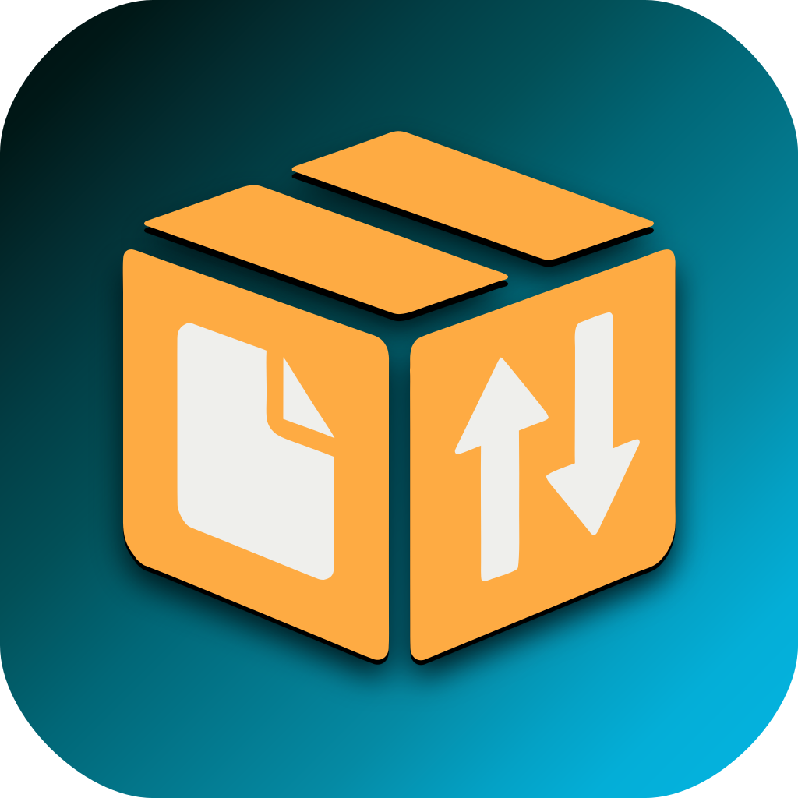

<p align="center"></p>

# filecargo

A FileZilla-style **FTP / FTPS / SFTP client** in Rust with two front-ends over one shared core:

- **`filecargo`**: native desktop GUI (gpui)
- **`filecargo-tui`**: keyboard-driven terminal UI (ratatui), works over SSH

Sites, folders and settings are shared: a site added in one front-end exists in the other.

## Features

- SFTP (password, key file, agent), FTP and FTPS (explicit and implicit) with certificate prompts and pinning
- Server tree with folders, FileZilla `sitemanager.xml` import, passwords in the OS keychain
- Local and remote panes: sorting, multi-select, rename, delete, chmod, new folder (on either pane)
- Transfer queue: resume, automatic retry, conflict rules (overwrite, newer, resume, skip, keep both), per-file progress; the panel follows the connected site; stage files with *Add to queue* and start, pause (per site) or clear them later; held items survive a restart
- Built-in SSH terminal tab (SFTP sessions)
- Log tab, notifications, light/dark theme (GUI)

## Install

Download the archive for your platform from the [Releases](../../releases) page and unpack it. Each
archive contains the GUI and `filecargo-tui`. Release builds are not code-signed.

- **macOS:** the GUI is `FileCargo.app`. Move it to `/Applications`, then on first launch allow it in
  *System Settings → Privacy & Security* (it is only ad-hoc signed, not notarized). Run
  `filecargo-tui` from a terminal.
- **Windows:** run `filecargo.exe` (GUI) or `filecargo-tui.exe`. SmartScreen may warn.
- **Linux:** run `filecargo` (GUI) or `filecargo-tui`. For the launcher entry and the icon (Wayland
  needs them), copy the binaries to a directory on your `PATH` and the `share/` folder into
  `~/.local/share/`:

  ```bash
  install -Dm755 filecargo filecargo-tui -t ~/.local/bin
  cp -r share/. ~/.local/share/
  ```

## Build from source

Requires [mise](https://mise.jdx.dev) (installs the Rust toolchain) or a recent stable Rust (1.92+).

```bash
cargo build --release -p filecargo-tui     # target/release/filecargo-tui
cargo build --release -p filecargo-gui     # target/release/filecargo   (needs the libraries below)
```

Plain `cargo build` / `cargo test` skip the GUI.

GUI build dependencies:

- **Debian / Ubuntu:** `libfontconfig-dev libfreetype-dev libwayland-dev libxkbcommon-x11-dev libx11-xcb-dev libvulkan1 mesa-vulkan-drivers`
- **NixOS:** `nix-shell --run "cargo build --release -p filecargo-gui"` (uses `shell.nix`)
- **macOS:** nothing extra. **Windows:** the Windows SDK (`fxc.exe`; set `GPUI_FXC_PATH` if it is not found).

## Run

```bash
filecargo            # GUI
filecargo-tui        # TUI;  --config-dir <path>, --help
```

The config directory can be changed with `FILECARGO_CONFIG_DIR` (GUI) or `--config-dir` (TUI).
Press `F1` in the TUI for its key bindings. Queue keys: `a` add to queue, and in the Queue tab `S` start, `p` pause / resume this site, `X` clear (asks first); `C` clears completed (Failed tab: failed).

## Develop

```bash
cargo fmt --all --check
cargo clippy --workspace --exclude filecargo-gui --all-targets -- -D warnings
cargo test

# integration tests against real servers (needs Docker)
docker compose -f tests/docker/compose.yml up -d --build --wait
cargo it
docker compose -f tests/docker/compose.yml down

cargo test -p filecargo-gui     # GUI tests are headless; needs the GUI build dependencies
```

Layout: `crates/filecargo-{config,remote-fs,transfer,terminal,app-core}` are the shared core,
`filecargo-tui` and `filecargo-gui` the front-ends. The design lives in `SPEC.md` and
`SPEC-*.md`; per-module plans and hand-off notes are in `tasks/`.

Manual smoke checklists: `crates/filecargo-tui/SMOKE.md`, `crates/filecargo-gui/SMOKE.md`.

## License

Licensed under either of [Apache License 2.0](LICENSE-APACHE) or [MIT](LICENSE-MIT) at your option.
Unless you state otherwise, any contribution you submit is dual-licensed as above, without further terms.
